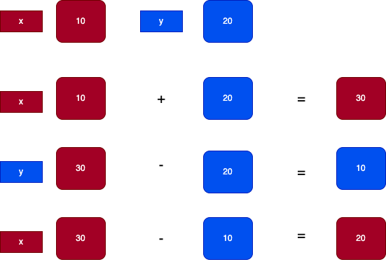
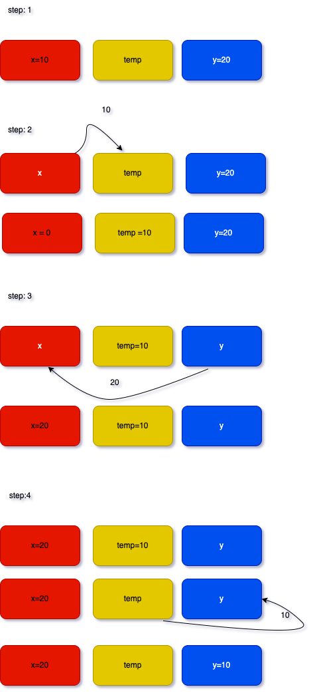

## প্রোগ্রামিং সমস্যা

N উপাদানগুলির একটি অ্যারে দেওয়া, কাজটি হল এটিকে দুবার সংযুক্ত করা, অর্থাৎ প্রদত্ত অ্যারের অনুলিপিটি নিজের সাথে যুক্ত করে 2\*N আকারের একটি অ্যারে তৈরি করা।

**ইনপুট**: `[1,2,1]`

**আউটপুট**: `[1,2,1,1,2,1]`

**ইনপুট**: `[1,3,2,1]`

**আউটপুট**: `[1,3,2,1,1,3,2,1]`

## সমস্যার বিস্তারিত ব্যাখ্যা:

আমদের ইনপুট হিসাবে একটি অ্যারে (array) দেওয়া হবে। ওই

## সমাধান (1)

এখন একটু চিন্তা করি আমরা, আমদের এবং আমদের বন্ধুর দুজনের বাক্স পরিপূর্ণ। তাই আমদের আপেল এবং আমদের বন্ধুর চকলেটের অদল বদল করতে পারছি না।

তার মানে কমপক্ষে যে কোন একজনের বাক্স খালি করতে হবে, তাহলে অন্য জনের বাক্সের জিনিস সেই বাক্সে নেওয়া যাবে। এক্ষেত্রে আমদের অন্য একটি খালি বাক্স সংগ্রহ করতে হবে। সেই বাক্সে আমদের লাল বাক্সের আপেল দিয়ে আমদের বাক্সেটি খালি করা যেতে পারে। এখন আমদের লাল বক্সে আমদের বন্ধুর চকলেট নিতে কোন অসুবিধা হবে না। আমদের বন্ধু খালি বাক্স থেকে আপেল খুব সহজেই তার নীল বাক্সে নিতে পারবে। তাহলে আমরা এবং আমদের বন্ধু আমদের প্রিয় রংয়ের বাক্স এবং পছন্দমত জিনিস নিয়ে বাড়ি ফিরতে পারব।

আমাদের এই প্রোগ্রামিং সমস্যা সমাধানটিও আমরা ঠিক একই ভাবে করতে পারি। এই প্রোগ্রামিং সমস্যা সমাধানের ধাপগুলো চিন্তা করি,

- আমার অন্য একটি ভেরিয়েবল নেব, যার নাম দেবো temp
- x এর মান temp রাখবো
- y এর মান x এ রাখবো
- temp মান y এ রাখবো



এখন আমরাই ধাপগুলো প্রোগ্রামিং এ করার চেষ্টা করব,

```js
function swap(x, y) {
  var temp = x;
  x = y;
  y = temp;

  console.log('x= ' + x + ' y= ' + y);
}

swap(10, 20);
```

এখানে কোডটি রান করে নিজেও অউটপুট দেখতে পারবে।

### টাইম কমপ্লেক্সিটি (1)

একটু লক্ষ্য করলে আমরা দেখতে পাব, আমরা এখনে কোন লুপ ব্যবহার করি নি। এই সমাধানে শুধু মান অ্যাসাইন করেছি।

> O(1)

### স্পেস কমপ্লেক্সিটি (1)

> O(1)

---

## সমাধান (2)

এবার আমরা অংকের মাধ্যমে এই প্রোগ্রামিং সমস্যাটি সমাধানের চেষ্টা করব। এখানে আমরা তৃতীয় কোন ভেরিয়েবল নেব না। চলো চিন্তা করি, এই প্রোগ্রামিং সমস্যার সমাধান কিভাবে করা যায়।

এই সমস্যা সমাধানের ধাপ গুলো দেখি,

- প্রথমে x এর মান হিসেবে x এবং y যোগ করি

  আমরা জানি, আমাদের ইনপুট x = 10, y = 20। এখন, x = x+y = 10+20 = 30

- y এর মান হিসাবে x এর মান থেকে y এর মান বিয়োগ করি

  `y = x-y = 30 - 20 = 10`

  এখন, y এর মান ১০। যদি আমদের ইনপুটের দিকে লক্ষ্য করি, x এর মান ছিল ১০ । আমরা y এর মান পরিবর্তন করতে সক্ষম হয়েছি।

- x এর মান হিসাবে x এর মান থেকে y এর মান বিয়োগ করি

  `x = x-y = 30 - 10 = 20`

  

এখন যদি আমরা এই ধাপগুলোকে কোডে পরিবর্তন করি,

```js
function swap(x, y) {
  x = x + y;
  y = x - y;
  x = x - y;

  console.log('x= ' + x + ' y= ' + y);
}

swap(10, 20);
```

### টাইম কমপ্লেক্সিটি (2)

একটু লক্ষ্য করলে আমরা দেখতে পাব, আমরা এখনে কোন লুপ ব্যবহার করি নি। এই সমাধানে শুধু মান অ্যাসাইন করেছি।

> O(1)

### স্পেস কমপ্লেক্সিটি (2)

> O(1)

---
